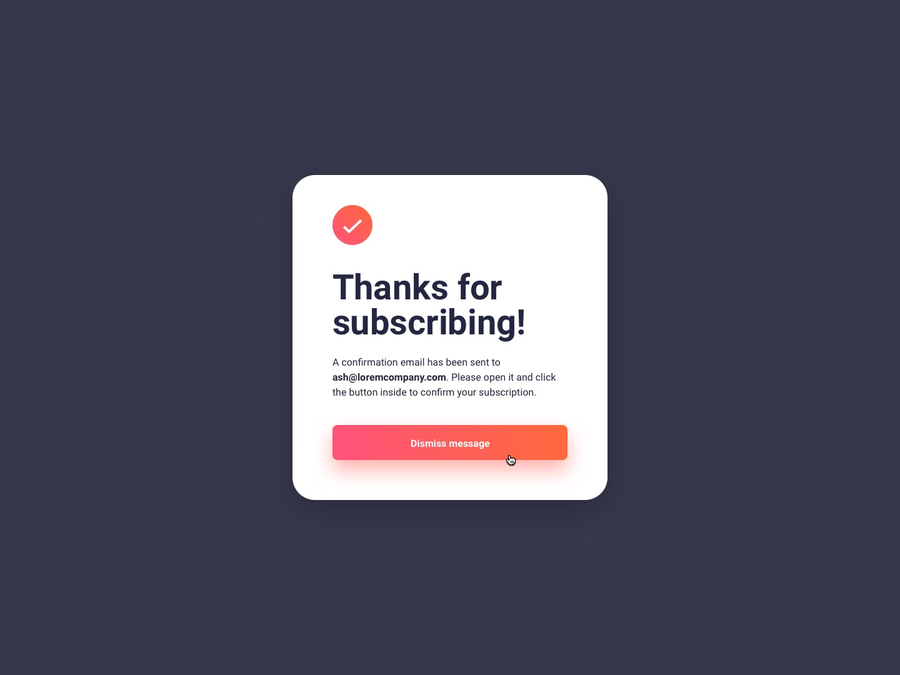

# Frontend Mentor - Newsletter sign-up form with success message solution

This is a solution to the [Newsletter sign-up form with success message challenge on Frontend Mentor](https://www.frontendmentor.io/challenges/newsletter-signup-form-with-success-message-3FC1AZbNrv). Frontend Mentor challenges help you improve your coding skills by building realistic projects.

## Table of contents

- [Overview](#overview)
  - [Screenshot](#screenshot)
  - [Links](#links)
- [My process](#my-process)
  - [Built with](#built-with)
  - [Useful resources](#useful-resources)
- [Acknowledgements](#acknowledgements)
- [Author](#author)

## Overview

### Screenshot

  
  
  
  
   
  
  

### Links

- Solution URL: [https://www.frontendmentor.io/solutions/newsletter-signup-form-with-success-message-using-ts-react-tailwind-fGuTY59H6I](https://www.frontendmentor.io/solutions/newsletter-signup-form-with-success-message-using-ts-react-tailwind-fGuTY59H6I)
- Live Site URL: [https://newsletter-sign-up-with-success-message-self.vercel.app/](https://newsletter-sign-up-with-success-message-self.vercel.app/)
- All Solutions URL: [https://frontend-mentor-solutions-mu.vercel.app/](https://frontend-mentor-solutions-mu.vercel.app/)

## My process

### Built with

  
  
  
    

### Useful resources

- [Gradient Color Stops](https://tailwindcss.com/docs/gradient-color-stops)

## Acknowledgements

- Challenge was provided by [Frontend Mentor](https://www.frontendmentor.io)

## Author

  
  
   
  

